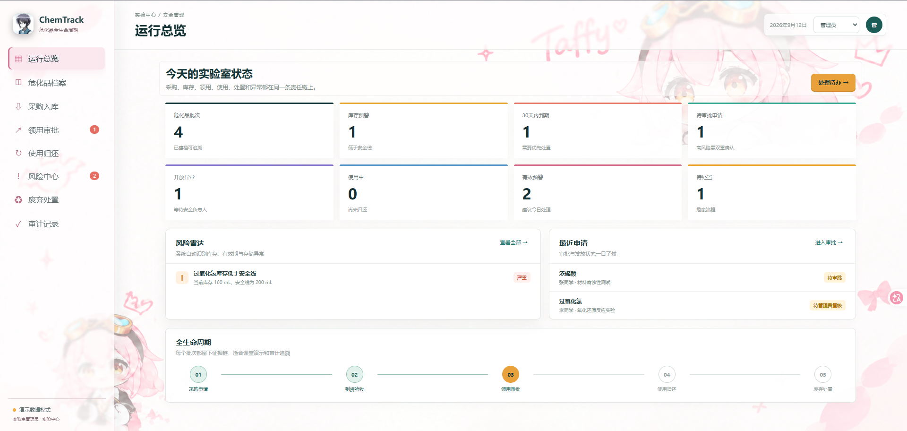
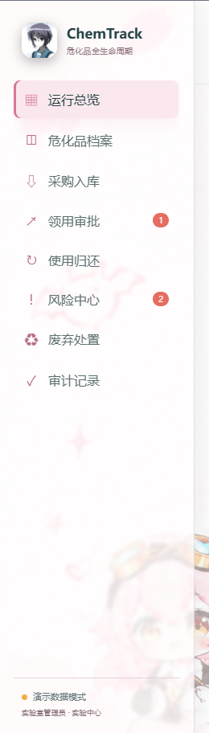
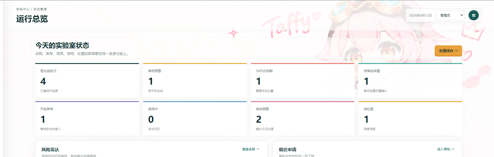
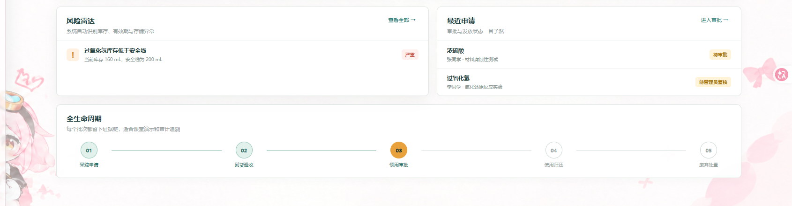

# ChemTrack_可行性与需求规格说明书_合并汇报_修订版

- Source: `ChemTrack_可行性与需求规格说明书_合并汇报_修订版.pptx`
- Total slides: 16

## Slide 1

SOFTWARE ENGINEERING

ChemTrack

把危化品管理变成一条可追溯责任链

可行性研究与需求规格说明书汇报

顾峰鸣：Web 版 张誉诚：Release 桌面端

采购

入库

领用

使用

归还

处置

审计

2026.09 · 课程设计答辩版

WEB × DESKTOP RELEASE

## Slide 2

01 / 问题与价值

责任链断裂，比功能不足更危险

危化品风险来自跨角色、跨状态的信息断裂；系统目标是把每一批次的证据链连接起来。

现状断点

ChemTrack 的回答

信息分散

一套台账

账本、表格、口头记录各自独立，库存和有效期无法联动。

批次、CAS、有效期、存储要求和二维码统一建档。

审批脱节

分级审批

申请、教师审批、管理员复核缺少统一的状态与证据。

高风险试剂必须教师审批 + 管理员复核。

责任难追

可追溯闭环

使用、归还、处置和异常分散，出问题时难以还原链路。

从采购到处置持续留痕，风险中心主动提示和收敛。

每一批危化品都能回答：从哪里来、谁批准、谁使用、剩多少、如何处置。

顾峰鸣 Web 版 · 张誉诚 Release 桌面端

CHEMTRACK / 02

02

## Slide 3

02 / 可行性研究

经济、技术、操作、社会与法律可行性

MVP 已跑通，当前重点是把可运行原型转成可部署、可治理、可审计的校园实验室系统。

01

02

03

04

05

经济

技术

操作

社会

法律

低成本复用

路线成熟

角色贴合

降低遗漏

制度复核

已有前后端与桌面端成果，部署与软件采购成本可控。

Java 17 + Spring Boot 3.4 + Vue 3 + Vite + MySQL 8 已跑通。

学生、教师、管理员、安全负责人按业务路径分区操作。

把安全责任从个人记忆转成流程证据，管理更透明。

覆盖安全能力，最终制度口径与法律适用由学校审核。

可验证

可验证

可验证

可验证

可验证

总判定 / 方案可行，下一阶段重点转向认证、备份、安全和合规治理。

顾峰鸣 Web 版 · 张誉诚 Release 桌面端

CHEMTRACK / 03

03

## Slide 4

03 / 系统边界与接口

双端交付，统一一套业务责任链

Web 版面向浏览器操作；Release 桌面端用 WPF + WebView2 封装，二者通过 REST API 连接同一套业务数据。

Web 版

Vue 3 + Vite
总览、档案、审批、预警、审计

REST API

MySQL 8

健康检查
业务状态流转
事务与审计

users · chemicals
requests · usages
audit_logs · alerts

Release 桌面端

.NET 8 WPF + WebView2
启动后端、健康检查、回收进程

统一状态 / 统一约束 / 统一留痕

角色边界：学生提交与归还 · 教师审批高风险申请 · 管理员复核、发放、入库 · 安全负责人处理异常与废弃物

顾峰鸣 Web 版 · 张誉诚 Release 桌面端

CHEMTRACK / 04

04

## Slide 5

04 / 业务闭环

从采购到处置：每个状态都有下一位责任人

正常链持续记录批次、审批、库存、使用与处置；异常路径负责阻断、预警和闭环处理。

01

02

03

04

05

06

07

08

采购

入库

领用

使用

归还

预警

处置

审计

正常链

异常分支

待采购 → 采购中 → 待验收 → 已入库 → 可领用 → 分级审批 → 已发放 → 使用中 → 已归还 → 待处置 → 已处置

库存不足 / 已过期 / 审批驳回 / 归还不一致 / 泄漏 / 存储异常

→ 阻断正常领用，生成预警或异常事件，进入处理与审计闭环

顾峰鸣 Web 版 · 张誉诚 Release 桌面端

CHEMTRACK / 05

05

## Slide 6

05 / 需求规格

功能需求：围绕危化品全生命周期形成闭环

每个核心动作都有角色边界、状态变化、数据对象和审计记录。

FR-01

FR-02

FR-03

批次档案

采购入库

领用审批

CAS、有效期、存储要求、二维码和位置

申请 → 审批 → 采购中 → 验收 → 入库

普通试剂单级审批，高风险双重审批

FR-04

FR-05

FR-06

出库与使用

归还登记

风险与审计

办理发放时事务扣减库存，建立使用记录

实际使用量、归还量、异常说明与库存回补

预警、异常、废弃物和汇总报表全程留痕

验收口径：角色可执行 · 状态可追踪 · 库存可校验 · 关键动作可审计

顾峰鸣 Web 版 · 张誉诚 Release 桌面端

CHEMTRACK / 06

06

## Slide 7

06 / 需求规格说明书

非功能需求：性能、可靠性、可用性、出错处理

安全系统不仅要完成操作，还要在边界条件下保持可预测、可恢复、可解释。

性能

可靠性

可用性

出错处理

课堂演示规模下列表与查询即时反馈

出库、归还使用事务，库存不能小于 0

后端未启动时进入演示数据模式

越权、过期、库存不足时阻断提交

验证 / 接口响应与边界数据测试

验证 / 异常回滚与日志核对

验证 / 断后端与恢复场景演示

验证 / 错误提示与阻断规则

可靠性与可用性证据

事务保障：出库、归还、审批状态一致；健康检查：/api/health 明确服务状态；演示回退：后端未启动时可进入演示数据模式；审计事实：关键动作不可删除。

顾峰鸣 Web 版 · 张誉诚 Release 桌面端

CHEMTRACK / 07

07

## Slide 8

07 / 需求规格说明书

接口需求、约束、逆向需求与将来可能提出的要求

把系统必须连接什么、必须遵守什么、绝不能做什么、未来如何扩展一次说清。

接口需求

约束 + 逆向需求

将来可能提出的要求

前端 / 桌面端 → REST API → MySQL

业务约束

统一认证与 JWT 登录
细粒度角色权限与通知中心
多实验室 / 多校区部署
二维码、移动端、电子签名
报表导出与自动备份
法规规则可配置、可审计

高风险试剂必须教师审批 + 管理员复核
库存不能小于 0
实际使用量 + 归还量 ≤ 发放量
普通用户不能修改历史审计

读接口
GET /health · /dashboard · /chemicals
GET /requests · /usages · /alerts
GET /incidents · /disposals · /audit
写接口
POST /requests · /procurements
PATCH /approve · /reject · /issue · /return
POST /alerts/refresh

系统绝不能

绕过审批直接出库
删除关键审计事实
让过期批次进入正常领用
把演示数据当真实台账

先满足边界，再扩展能力

顾峰鸣 Web 版 · 张誉诚 Release 桌面端

CHEMTRACK / 08

08

## Slide 9

08 / 需求分析建模

数据流图（DFD）：外部实体、处理过程、数据存储与数据流

以“领用申请 → 分级审批 → 发放扣减 → 使用归还 → 预警审计”为主线，展示数据如何穿过系统。

D1 用户 / 角色库

P1 档案与入库

学生

users · roles

批次、库存、有效期

领用申请 / 归还

入库 / 库存

申请

D2 危化品 / 批次库存库

chemicals · batches

指导教师

P2 领用与审批

P4 风险与处置

审批意见

异常条件

高风险审批

申请、教师审批、管理员复核

预警、异常、危废流程

申请 / 审批

D3 申请 / 审批 / 使用库

requests · approvals · usages

预警 / 处置

管理员 / 安全负责人

操作指令

D4 预警 / 处置 / 审计库

P3 使用与归还

P5 审计与报表

使用记录

入库 / 复核 / 处置

发放扣减、实际用量、回补

关键动作、统计摘要

alerts · disposals · audit_logs

审计结果

读写数据流：前端 / 桌面端提交操作，核心处理校验状态与库存，数据存储保留业务事实。

顾峰鸣 Web 版 · 张誉诚 Release 桌面端

CHEMTRACK / 09

09

## Slide 10

09 / 需求分析建模

实体-联系图（ER）：申请单连接责任、库存、使用与处置

实体、主键 / 外键和基数关系来自 ChemTrack 的业务表设计；申请单是审批责任的中心。

User / Role

Chemical / Batch

Request

1:N 申请

1:N 批次

PK user_id

PK chemical_id

PK request_id

name · role

CAS · batch_no

FK chemical_id

1:N Request

expiry · quantity

amount · status

1:N 预警

1:N AuditLog

1:N Request / Alert

applicant · supervisor

Alert

PK alert_id

1:1 使用

1:N 审批

1:1 发放

0..N 处置

FK chemical_id

level · status

created_at

ApprovalRecord

UsageRecord

Disposal

PK approval_id

PK usage_id

PK disposal_id

FK request_id

FK request_id

FK chemical_id

stage · approver

issued · actual

waste · amount

decision · time

returned · abnormal

status · company

对应数据表：users · chemicals · procurements · requests · approval_records · usage_records · incidents · disposals · alerts · audit_logs

顾峰鸣 Web 版 · 张誉诚 Release 桌面端

CHEMTRACK / 10

10

## Slide 11

10 / 需求分析建模

状态转换图：状态、触发事件与异常分支

状态决定下一步权限、库存行为和审计动作；每次转换都有明确触发事件。

采购申请

采购完成

到货验收

入库登记

提交申请

待采购

采购中

待验收

已入库

可领用

待审批

进入审批链

审批通过

管理员复核

办理发放

实验开始

归还登记

已复核

已发放

使用中

已归还

待处置

已处置

生成预警

上报 / 审计

异常状态

已过期 / 冻结 · 库存不足 · 审批驳回 · 归还不一致 · 泄漏 / 存储异常

阻断领用

顾峰鸣 Web 版 · 张誉诚 Release 桌面端

CHEMTRACK / 11

11

## Slide 12

11 / 实现与演示

运行总览：风险、库存、审批和生命周期在同一屏

以下为 ChemTrack 前端实际运行界面截图；当前项目支持后端在线与演示数据模式两种展示路径。

批次档案

库存预警

4

1

已建档可追溯

低于安全线

待审批

有效预警

1

2

高风险需复核

建议今日处理

截图可见的证据

侧栏导航 · 风险雷达 · 最近申请
全生命周期步骤 · 角色切换 · 待办入口

真实运行界面 / 运行总览

顾峰鸣 Web 版 · 张誉诚 Release 桌面端

CHEMTRACK / 12

12

## Slide 13

11 / 实现与演示

界面证据：从“看见风险”到“留下记录”

把同一份运行界面拆成三个操作证据区，便于在答辩中对应需求和验收口径。

总览指标 / 批次、库存、审批、预警

风险雷达 + 最近申请 / 待办聚合

生命周期导航 / 统一入口

页面 → REST API → 数据库表 → 审计记录：每一次操作都可以在链路上定位。

顾峰鸣 Web 版 · 张誉诚 Release 桌面端

CHEMTRACK / 13

13

## Slide 14

12 / 双端交付

Release 桌面端：把 Web 能力封装成可启动产品

桌面端不是另一套业务逻辑，而是 WPF 壳 + WebView2 + 后端进程管理，共享同一套接口和数据。

启动后端

启动时检查 /api/health；未就绪则拉起 backend JAR。

ChemTrack 化危品管理平台

WPF Window

加载界面

EnsureCoreWebView2Async 后导航到本地服务。

退出回收

窗口关闭时回收后端进程，减少遗留服务。

桌面端交付价值：降低课堂启动门槛，同时保留 Web 端持续迭代能力。

顾峰鸣 Web 版 · 张誉诚 Release 桌面端

CHEMTRACK / 14

14

## Slide 15

13 / 课堂演示

一条真实路径，证明需求可以落地

每一步都能在前端页面、REST API、数据库表和审计记录中定位。

序号

动作

页面能力

接口

数据对象

验收结果

01

采购入库

新建批次

POST /procurements

procurements

状态推进

02

提交申请

领用审批

POST /requests

requests

申请待审批

03

教师审批

分级审批

PATCH /approve

approval_records

教师已审批

04

管理员复核

高风险二次确认

PATCH /approve

approval_records

可办理发放

05

办理发放

出库扣减

PATCH /issue

usage_records

库存变化

06

使用归还

实际量与回补

PATCH /return

usage_records

归还留痕

07

风险扫描

库存 / 有效期

POST /alerts/refresh

alerts

生成预警

08

查看审计

证据汇总

GET /audit

audit_logs

动作不可删除

状态推进 + 库存变化 + 留痕

顾峰鸣 Web 版 · 张誉诚 Release 桌面端

CHEMTRACK / 15

15

## Slide 16

FINAL CHECK

可行、可验收、可持续演进

ChemTrack 已具备课程设计所需的可运行 MVP，需求边界和演进路径清晰。

01

02

03

可行性

需求

实现

技术与操作已验证，经济可控，社会价值明确；法律方向需制度复核。

功能、性能、可靠性、可用性、异常、接口、约束、逆向与未来要求均有落点。

Vue + Spring Boot + MySQL 与 DFD / ER / 状态模型保持一致。

每一个需求是否都有角色、状态、数据、接口和验收证据？

答辩检查句

感谢聆听

ChemTrack / Web × Desktop Release / 2026.09
